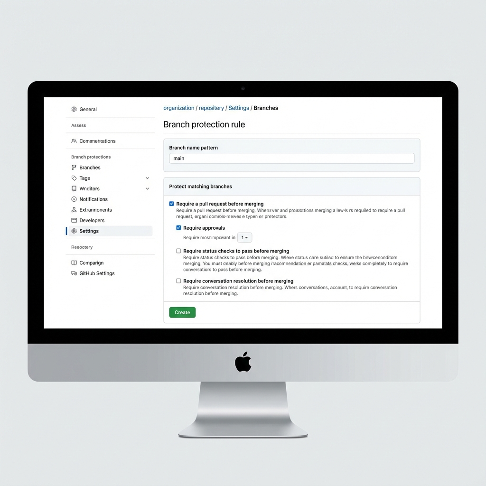

# How to Set Up Collaboration on GitHub

Since I cannot log into your GitHub account to change settings for you, I have created this visual guide to help you do it yourself.

## Part 1: Invite Your Team

1.  Go to your repository page on GitHub (e.g., `https://github.com/YOUR_USERNAME/exolorer-app`).
2.  Click the **Settings** tab (the gear icon ⚙️) at the top right.
3.  On the left sidebar, click **Collaborators** (under the "Access" section).
4.  Click the green **Add people** button.
5.  Enter their email or username and click **Add**.
    *   *They will receive an email invite. They must accept it to join.*

---

## Part 2: Protect Your "Main" Branch (Crucial!)

This prevents people (and you!) from accidentally breaking the app. It forces everyone to submit a "Pull Request" so code can be reviewed before it is merged.

1.  In **Settings**, click **Branches** on the left sidebar (under "Code and automation").
2.  Click **Add branch protection rule**.
3.  **Branch name pattern**: Type `main`.
4.  Check these boxes:
    *   [x] **Require a pull request before merging**
    *   [x] **Require approvals** (Leave it at 1).
5.  Scroll to the bottom and click **Create**.



---

## Part 3: How Your Team Will Work

Once you have set this up, here is the workflow your team (and you) should follow:

1.  **Get the latest code**:
    ```bash
    git checkout main
    git pull origin main
    ```

2.  **Create a new branch** for a feature (never work on main directly!):
    ```bash
    git checkout -b feature/new-login-page
    ```

3.  **Make changes** and commit them:
    ```bash
    git add .
    git commit -m "Added login page design"
    ```

4.  **Push the branch** to GitHub:
    ```bash
    git push origin feature/new-login-page
    ```

5.  **Create a Pull Request (PR)**:
    *   Go to your GitHub page.
    *   You will see a yellow banner saying "feature/new-login-page had recent pushes".
    *   Click **Compare & pull request**.
    *   Fill out the template (I created this for you earlier!) and click **Create pull request**.

6.  **Review and Merge**:
    *   Send the link to your teammate.
    *   They review the code and click **Approve**.
    *   Then you can click **Merge pull request**.

This keeps your `main` branch clean and working perfectly at all times!
